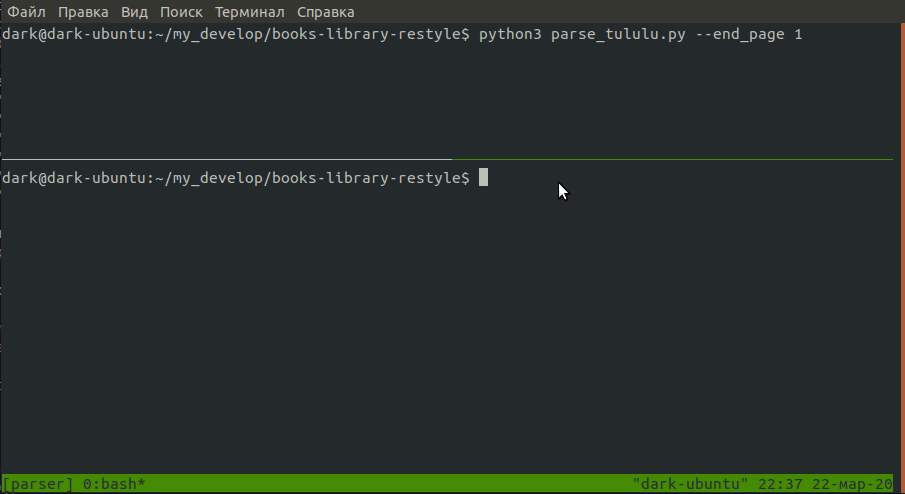

# Парсер книг с сайта tululu.org

Программа написана для загрузки книг и титульных изображений книг c 
сайта ["БОЛЬШАЯ БЕСПЛАТНАЯ БИБЛИОТЕКА"](http://tululu.org/)
При запуске в каталоге с программой создается каталог 'books',в кором создаются
подкаталоги с названием книг с текстовыми содержимым и титульными изображениями.
после успешной загрузки данных создается json файл с описанием каждой книги.

### Пример работы:



### Как установить
Python3 должен быть уже установлен. Затем используйте pip (или pip3, есть конфликт с Python2) для установки зависимостей: 
```
pip3 install -r requirements.txt
```

### Аргументы

Все аргументы не являются обязательными

```
-h, --help  - справка
--start_page 'значение',по умолчанию: 1 - Начальная страница каталога книг
--end_page 'значение',по умолчанию: максимально доступная - Последняя страница каталога книг
--dest_folder 'имя_каталога', по умолчанию:books - Каталог для данных
--json_path 'имя_каталога' по умолчанию: books - Каталог для JSON данных
--skip_imgs - Не загружать изображения
--skip_txt - Не загружать текст
--show_url - Отображать только url книги
```
### Запуск:

```
$ python3 parse_tululu.py --end_page 1
```

### Цель проекта

Код написан в образовательных целях на онлайн-курсе для веб-разработчиков [dvmn.org](https://dvmn.org/).